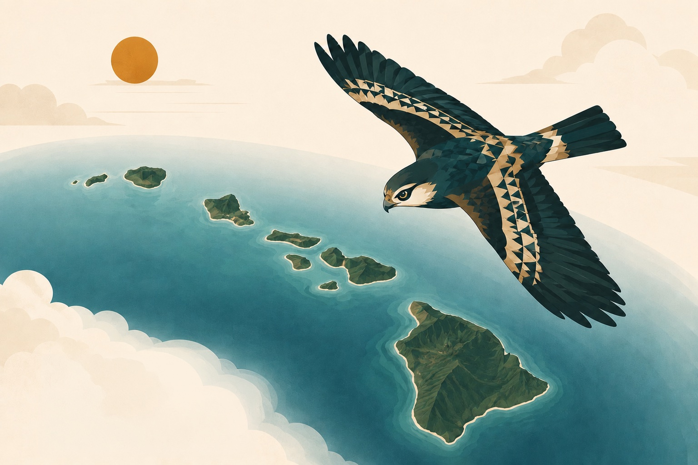

  

  <h1>Aloha, I'm Christian 👋</h1>
  <h3>Software Developer · IT Specialist · Product Builder</h3>

  

    I build resilient, accessible digital products for Hawaiʻi and beyond. 
    From offline-first emergency tools to native iOS apps and immersive web experiences,
    I turn practical problems into technology people can rely on.
  

  

    
    
    
    
  

<table>
  <tr>
    <td align="center"><strong>5+ years</strong> building &amp; supporting technology</td>
    <td align="center"><strong>12+ feeds</strong> unified for emergency readiness</td>
    <td align="center"><strong>177 questions</strong> shipped in a native iOS app</td>
    <td align="center"><strong>Web · Mobile · Cloud · IT</strong> from architecture to deployment</td>
  </tr>
</table>

## Featured work

<table>
  <tr>
    <td width="33%" valign="top">
      <h3>🌋 <a href="https://kilohi.org">Kilo</a></h3>
      
<strong>Emergency information built for island realities.</strong>

      
An offline-first PWA and mobile app that brings official Hawaiʻi alerts, shelters, road closures, earthquakes, volcanoes, tsunami zones, and weather into one plain-language view.

      
<code>Next.js</code> <code>React</code> <code>Convex</code> <code>Cloudflare</code> <code>Capacitor</code>

    </td>
    <td width="33%" valign="top">
      <h3>🚙 <a href="https://apps.apple.com/us/app/aloha-permit-hawaii-dmv-prep/id6759213337">Aloha Permits</a></h3>
      
<strong>Hawaiʻi DMV preparation, made approachable.</strong>

      
A native iOS study app with 177 practice questions, freemium access, AdMob integration, and private on-device AI powered by Apple's Foundation Models.

      
<code>SwiftUI</code> <code>Swift</code> <code>Foundation Models</code> <code>AdMob</code>

    </td>
    <td width="33%" valign="top">
      <h3>🌊 <a href="https://csprinkels.com">csprinkels.com</a></h3>
      
<strong>A portfolio you can explore.</strong>

      
An interactive 3D environment with custom animation, responsive design, and an optimized asset pipeline—built to make browsing feel playful.

      
<code>React</code> <code>Three.js</code> <code>React Three Fiber</code> <code>TypeScript</code>

    </td>
  </tr>
</table>

## What I work with

| Product engineering | Mobile | Cloud & backend | IT & networking |
| --- | --- | --- | --- |
| React, Next.js, TypeScript, Tailwind CSS, accessibility, Playwright | SwiftUI, Swift, Capacitor, PWAs, Web Push, Foundation Models | Node.js, Convex, Cloudflare Pages & R2, SQL, GitHub Actions, Docker | Microsoft 365, Azure, Active Directory, Cisco Meraki, Ubiquiti UniFi, VPNs |

## The thread through my work

My background spans software development, enterprise IT, education, and community organizations. Whether I am designing a public-facing product, supporting a school, or teaching students to build with technology, I care about the same things: **usefulness, clarity, resilience, and the people on the other side of the screen.**

  <h3>Let's build something useful.</h3>
  
<a href="mailto:aloha@csprinkels.com">aloha@csprinkels.com</a> · <a href="https://csprinkels.com">csprinkels.com</a>

