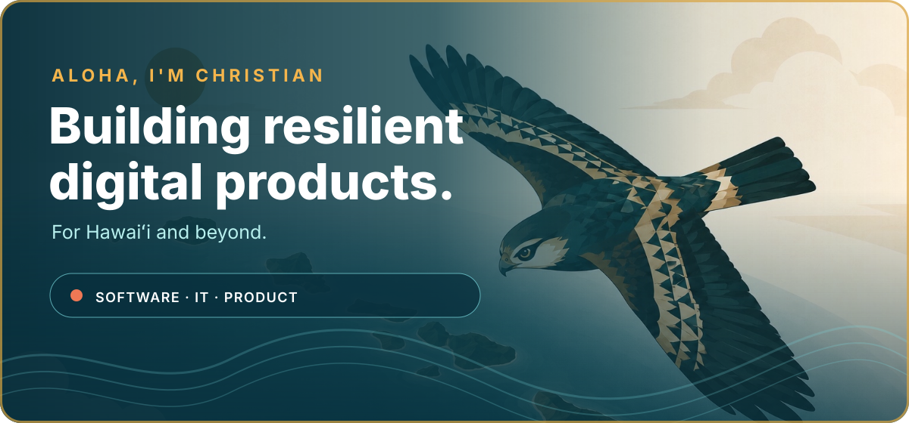

  

   

  
  
  
  

 

## Selected work

###  [Kilo](https://kilohi.org)

Offline-first emergency information for Hawaiʻi. Kilo brings alerts, shelters, road closures, earthquakes, volcanoes, tsunami zones, and weather into one resilient, plain-language view.

`Next.js` `React` `Convex` `Cloudflare` `Capacitor`

---

###  [Aloha Permits](https://apps.apple.com/us/app/aloha-permit-hawaii-dmv-prep/id6759213337)

A native Hawaiʻi DMV study app with 177 practice questions, freemium access, and private on-device AI powered by Apple Foundation Models.

`SwiftUI` `Swift` `Foundation Models` `AdMob`

---

###  [csprinkels.com](https://csprinkels.com)

An interactive 3D portfolio with custom animation, responsive design, and an optimized asset pipeline.

`React` `React Three Fiber` `Three.js` `TypeScript`

##  What I build with

- **Product:** React, Next.js, TypeScript, Tailwind CSS, accessibility, Playwright
- **Mobile:** SwiftUI, Swift, Capacitor, Progressive Web Apps, Web Push
- **Cloud:** Node.js, Convex, Cloudflare Pages & R2, SQL, GitHub Actions
- **IT:** Microsoft 365, Azure, Active Directory, Cisco Meraki, Ubiquiti UniFi

 

  
  <h2>Let's build something useful.</h2>
  
<a href="mailto:aloha@csprinkels.com">aloha@csprinkels.com</a> · <a href="https://csprinkels.com">csprinkels.com</a>

