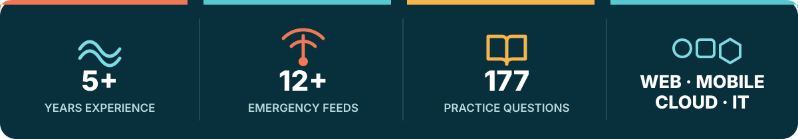
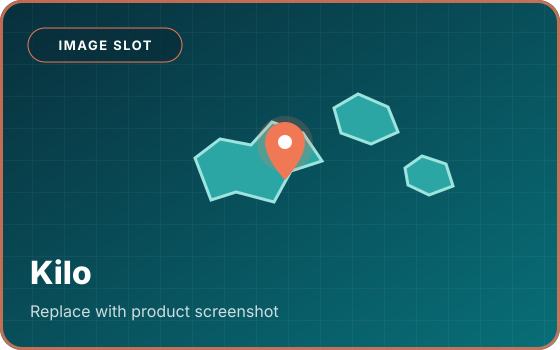
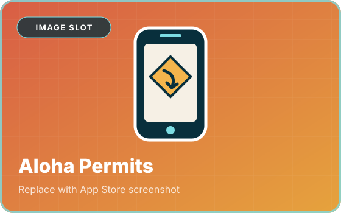
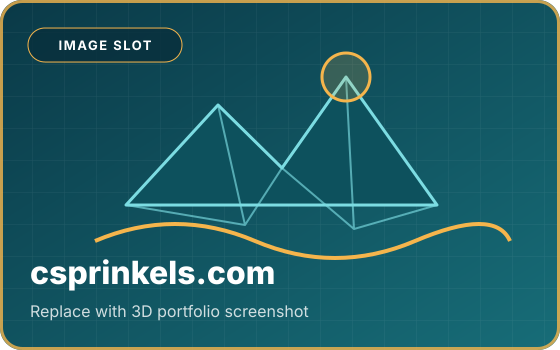

  

   

  
  
  
  

 

## 🌊 Featured Work

<table>
  <tr>
    <td width="33%" valign="top">
      
      <h3><a href="https://kilohi.org">Kilo</a></h3>
      
<strong>Emergency information built for island realities.</strong>

      
One resilient, plain-language view of official Hawaiʻi alerts, shelters, closures, earthquakes, volcanoes, tsunami zones, and weather.

      
<code>Next.js</code> <code>Convex</code> <code>Cloudflare</code>

    </td>
    <td width="33%" valign="top">
      
      <h3><a href="https://apps.apple.com/us/app/aloha-permit-hawaii-dmv-prep/id6759213337">Aloha Permits</a></h3>
      
<strong>Hawaiʻi DMV preparation, made approachable.</strong>

      
A native iOS study app with 177 questions, freemium access, and private on-device AI powered by Apple Foundation Models.

      
<code>SwiftUI</code> <code>Swift</code> <code>Foundation Models</code>

    </td>
    <td width="33%" valign="top">
      
      <h3><a href="https://csprinkels.com">csprinkels.com</a></h3>
      
<strong>A portfolio you can explore.</strong>

      
An interactive 3D environment with custom animation, responsive design, and an optimized asset pipeline.

      
<code>React</code> <code>Three.js</code> <code>TypeScript</code>

    </td>
  </tr>
</table>

## 🌀 What I Work With

<table>
  <tr>
    <td width="25%" valign="top">
      <h3>⌨️ Product</h3>
      React 
      Next.js 
      TypeScript 
      Tailwind CSS 
      Accessibility 
      Playwright
    </td>
    <td width="25%" valign="top">
      <h3>📱 Mobile</h3>
      SwiftUI 
      Swift 
      Capacitor 
      Progressive Web Apps 
      Web Push 
      Foundation Models
    </td>
    <td width="25%" valign="top">
      <h3>☁️ Cloud</h3>
      Node.js 
      Convex 
      Cloudflare Pages &amp; R2 
      SQL 
      GitHub Actions 
      Docker
    </td>
    <td width="25%" valign="top">
      <h3>📡 IT</h3>
      Microsoft 365 
      Azure &amp; Active Directory 
      Cisco Meraki 
      Ubiquiti UniFi 
      VPNs 
      Technical Training
    </td>
  </tr>
</table>

 

  <h2>Useful. Clear. Resilient. Human.</h2>
  

    I bring product engineering, enterprise IT, and community experience together 
    to build technology that works for the people on the other side of the screen.
  

  <h3><a href="mailto:aloha@csprinkels.com">Let's build something useful →</a></h3>

